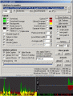
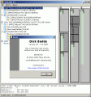
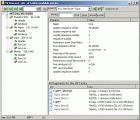
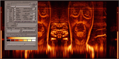
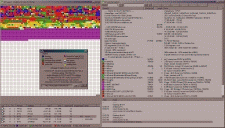
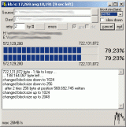
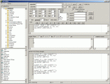
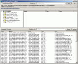
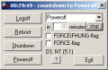
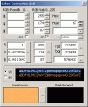

blumetools

Freeware (some with source code): use it as you wish. No licence stuff. Use at your own risk. Unpack und run. All programs and sources packed with ZIP. Binaries additionally packed with [UPX](http://www.oberhumer.com/opensource/upx/). Screenshoots not always from current version.

#### TrafMon 1.5

Trafmon options and two sample layouts

Network Traffic Monitor for Windows (NTs4/2K/XP/V/7/8/10)

[trafmon15\_bin.zip](files/trafmon15_bin.zip") - 613 kB ( downloads) - May 13 2017

[trafmon15\_src.zip](files/trafmon15_src.zip") - 698 kB (Delphi 2010) ( downloads) - May 13 2017

[TrafMon.txt](files/trafmon/TrafMon.txt)

#### DiskBuddy 0.8

   
DiskBuddy main Window and DiskBuddy showing an NFTS MFT-record

HDD/Partition NTFS/FAT browser and info, a project I continued from version 0.4.1 (thanks to miika from finland)

[diskbuddy08\_bin.zip](files/diskbuddy08_bin.zip") \- 795 kB ( downloads) - December 22 2016 (actually May 13 2017)

[diskbuddy08\_src.zip](files/diskbuddy08_src.zip") \- 1,334 kB ( downloads) - December 22 2016 (actually May 13 2017)

[DiskBuddy.txt](files/diskbuddy/DiskBuddy.txt)

#### SonoGram 3.5

SonoGram showing the face from Aphex Twins 'equation'
[old version screenshot](pics/sonogram.gif)

Windows (NTs4/2K/XP/V/7) program to draw a sonagram (aka spectrogram) of audio data grabbed from a soundcards input/record channel or from an audio file.

[sonogram35\_bin.zip](files/sonogram35_bin.zip") - 340 kB ( downloads) - May 31 2012

[sonogram35\_src.zip](files/sonogram35_src.zip") - 1.17 MB ( downloads) - May 31 2012

[readme.txt](files/sonogram/readme.txt)

#### Defragger 3.9alpha

Defragger in Aktion

Windows (NTs4/2K/XP/V/7/PE 32+64b) program to defrag FAT16/32/NTFS-partitions (on removable drives too). Based on Windows built-in Defrag API. Single-file defrag, file-sizelimit, Drive-information (system files, MFT, reparse points, bitmaps, attribute lists), locked files, large files, cluster-viewer, file-search, configurable blocksize, large-file-marks. Commandline options.

[defragger39a\_bin.zip](files/defragger39a_bin.zip") - 113 kB ( downloads) - 25. November 2008

[defragger39a\_src.zip](files/defragger39a_src.zip") - 142 kB ( downloads) - 25. November 2008

[readme.txt](files/defragger/readme.txt)

#### Kopy 2.0

kopy in action on a scratched CD

*   copy program with adjustable cache and resume mode
*   cache size adjustable during copy-progress
*   resume partial files
*   adjustable retry value on read-errors (for example useful on scratched CDs)
*   skip blocks on read error/write NULL-blocks
*   remaining time display/speed display/speed graph
*   copy including sub-directories, wildcards allowed (\*.exe)
*   physically delete (overwrite) content of files ([more about physically deleting files](delfilesen.html"))

[kopy20\_bin.zip](files/kopy20_bin.zip") - 181 kB ( downloads) - Januar 10 2007

[kopy20\_src.zip](files/kopy20_src.zip") - 18 kB (delphi7) ( downloads) - Januar 10 2007

[readme.txt](files/kopy/readme.txt)

#### AutoEditor 1.1

AutoEditor with some generated java code

Tool for automatic text manipulation via masks and counters. Features: search and replace, open save, browse ... usefull for programmers or simply for fast generating a lot of text. This program was coded fast und dirty and comes with no doc.

[autoeditor11\_bin.zip](files/autoeditor11_bin.zip") - 314 kB ( downloads) - March 30 2012

[autoeditor11\_src.zip](files/autoeditor11_src.zip") - 353 kB ( downloads) - March 30 2012

[readme.txt](files/autoeditor/readme.txt)

#### RegSR 2.0

RegSR in Aktion

*   Search and Replace/Delete strings in the Windows-Registry-Database
*   fast Search because of skipping mirrored branches of the registry
*   first search, then select from results, which branches/keynames/key-values to replace/delete
*   search for REG\_SZ, REG\_EXPAND\_SZ, REG\_MULTI\_SZ registry-types

[regsr20\_bin.zip](files/regsr20_bin.zip") - 211 kB ( downloads)

[readme.txt](files/regsr/readme.txt)

#### ExitWin 2.0

ExitWin countdown

*   shutdown/reboot/logoff Windows or shutdown with a timer
*   or use it from commandline ( exitwin.exe /? )
*   same as the WinXP-Utility "shutdown /?"

[exitwin.zip](files/exitwin.zip") \- 11 kB ( downloads)

[exitwinsrc.zip](files/exitwinsrc.zip") - 13 kB (VB6) ( downloads)

#### ColorConverter 2.0

Farb-Konverter in action

*   color converter from/into four formats
*   select/change/show colors
*   colors-formats: RGB\[0..1\]/RGB\[0..255\]/hexadecimal/windows-color-value(0..16777215)
*   form to import to VBA (Excel/Word/Corel) or VB6

[colorconvsrc.zip](files/colorconvsrc.zip") - 6 kB (VBA) ( downloads)

#### links

Joeren Kessel's [JKDefrag](http://www.kessels.com/JKDefrag/) and [MyDefrag](http://www.mydefrag.com/)
[Sequoia View](http://www.win.tue.nl/sequoiaview/), [WinDirStat](http://windirstat.info/)
[BartPE](http://www.nu2.nu/pebuilder/)
[PageDefrag](http://www.microsoft.com/technet/sysinternals/FileAndDisk/PageDefrag.mspx)
[DVDisaster](http://www.dvdisaster.com/)

* * *

[Ninite multi installer](https://ninite.com/)
[Teamviewer download](https://www.teamviewer.com/en/download/windows/)
[SysInternals](https://www.sysinternals.com/)